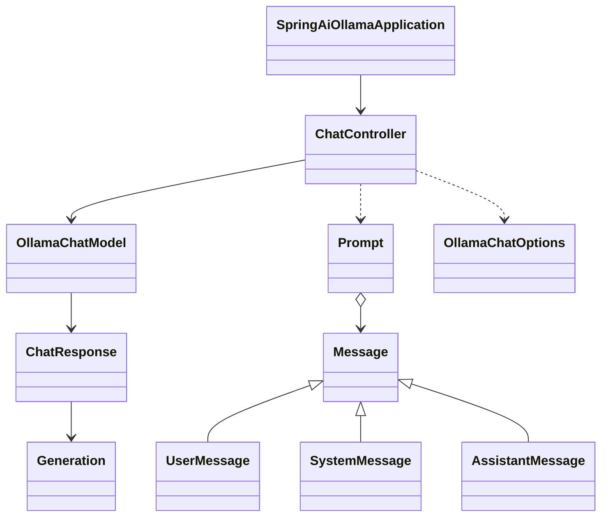
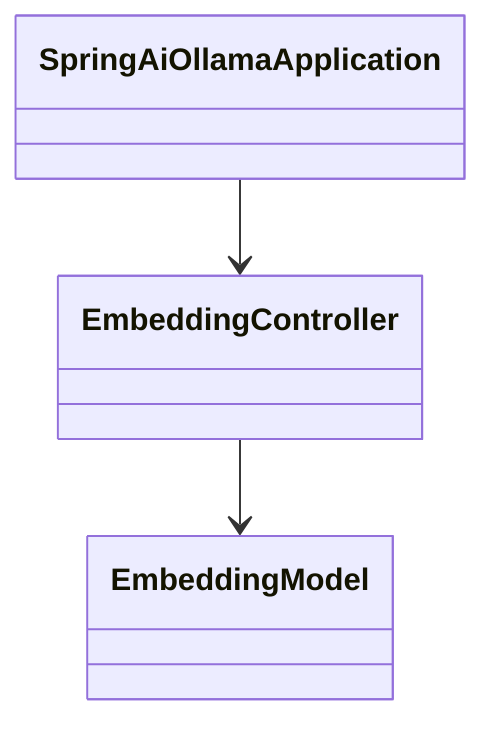
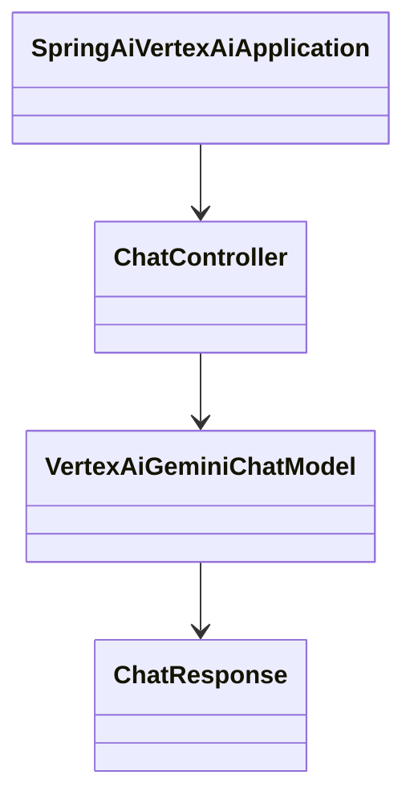

# Spring AI 学习示例项目

> 基于 **Spring Boot 3.5.6** 与 **Spring AI 1.1.4**（版本以 `pom.xml` 中 `spring-boot-starter-parent` / `spring-ai.version` 为准）的多模块示例工程，覆盖 Chat、Embedding、RAG、Tool Calling、MCP、可观测性等能力。

**官方文档（验收与迁移请以官方为准）:** [Spring AI Reference](https://docs.spring.io/spring-ai/reference/index.html)

**本地教程（可选）:** [Spring AI 完整教程](https://wiki.hiwepy.com/docs/spring-ai) · **文档四层索引（基础 / 入门 / 增强 / 项目）:** [docs/README.md](docs/README.md)

**子模块 README 结构说明:** [docs/README-TEMPLATE.md](docs/README-TEMPLATE.md) · **RAG 共用说明:** [docs/2-Spring AI 入门实践/RAG-SHARED.md](docs/2-Spring%20AI%20入门实践/RAG-SHARED.md) · **架构图与调用链:** 见下文 [项目结构图与对象关系图](#项目结构图与对象关系图)（原 `docs/architecture-diagrams.md` 已合并至此）


## 能力 → 模块 → Reference 章节（索引）

| Spring AI 能力域 | Reference 章节 | 示例模块（节选） |
|------------------|----------------|-------------------|
| Chat / ChatClient | [Chat Model](https://docs.spring.io/spring-ai/reference/api/chatmodel.html)、[ChatClient](https://docs.spring.io/spring-ai/reference/api/chatclient.html) | `spring-ai-ollama-chat`、`spring-ai-openai`、`spring-ai-deepseek` |
| Embedding | [Embeddings](https://docs.spring.io/spring-ai/reference/api/embeddings.html) | `spring-ai-ollama-embedding` |
| RAG | [RAG（ChatClient）](https://docs.spring.io/spring-ai/reference/api/chatclient.html#_retrieval_augmented_generation) | `spring-ai-ollama-rag-*` |
| Vector Store | [Vector Databases](https://docs.spring.io/spring-ai/reference/api/vectordbs.html) | 同上 |
| Tool Calling | [Tools](https://docs.spring.io/spring-ai/reference/api/tools.html) | `spring-ai-ollama-tools` |
| MCP | [MCP](https://docs.spring.io/spring-ai/reference/api/mcp/mcp-overview.html) | `spring-ai-ollama-mcp-webmvc-*`、`spring-ai-ollama-mcp-webflux-*` |
| ETL / 文档 | [ETL Pipeline](https://docs.spring.io/spring-ai/reference/api/etl-pipeline.html) | `spring-ai-ollama-embedding`（PDF 等） |
| Observability | [Observability](https://docs.spring.io/spring-ai/reference/observability/index.html) | `spring-ai-ollama-observation-prometheus`、`spring-ai-ollama-observation-langfuse` |
| Structured Output | [Structured Output](https://docs.spring.io/spring-ai/reference/api/structured-output-converter.html) | 各厂商示例中结构化返回示例 |

各子目录均有 `README.md`，含运行步骤与官方链接；RAG 向量库差异见 [docs/2-Spring AI 入门实践/RAG-SHARED.md](docs/2-Spring%20AI%20入门实践/RAG-SHARED.md)。

## 项目简介
本项目同时具备两重属性：
- Spring AI 学习示例：基于 Spring Boot 3.5.x 与 Spring AI 1.1.x（以父 `pom.xml` 为准），覆盖 AI 模型集成、Ollama 本地推理、RAG 检索增强、语音处理、监控与日志，以及典型应用示例，具备文本、图像、语音等多模态能力。
- 博客文案配套：与博客文档一一对应，便于“实践代码 ↔ 教程文章”的同步学习与输出。详见文档：https://wiki.hiwepy.com/docs/spring-ai。

### 目录
- [📚 项目概述](#-项目概述)                                                                                                                                                                                                                                                                                                
- [🚀 快速开始](#-快速开始)
- [📦 项目结构](#-项目结构)
- [🎯 核心功能详解](#-核心功能详解)
- [🔗 与博客文案对应导航](#-与博客文案对应导航)
- [📖 学习路径](#-学习路径)
- [🔧 配置与部署](#-配置与部署)
- [💡 实际案例](#-实际案例)
- [📊 技术栈详情](#-技术栈详情)
- [🧪 测试与验证](#-测试与验证)
- [🐛 故障排除](#-故障排除)
- [🤝 贡献指南](#-贡献指南)
- [📚 参考资源](#-参考资源)
- [📄 许可证](#-许可证)

---

## 📚 项目概述

本项目是一个企业级的 Spring AI 学习平台，涵盖：

- ✅ **20 个 AI 模型集成示例** - OpenAI、Anthropic、Azure、Bedrock、Ollama 等主流供应商
- ✅ **8 个 Ollama 核心功能** - 本地部署和推理
- ✅ **17 个 RAG 检索增强示例** - 多种向量数据库集成
- ✅ **6 个语音处理模块** - 识别、合成、助手等
- ✅ **2 个监控追踪模块** - Prometheus 和 Langfuse
- ✅ **4 个实战应用示例** - SQL 生成、Agent、MVC 等

**适用人群：**
- Spring Boot 开发者
- AI 应用开发初学者
- 想要学习 LLM 集成的工程师
- RAG 和向量数据库应用开发者

---

## 项目说明
- 项目用途：提供可直接运行的示例与最佳实践，帮助初学者和工程师快速上手 Spring 与 Spring AI 的核心能力，作为学习与原型验证之用。
- 适用人群：Spring 入门实践者、AI 应用开发者、对 RAG/多模态/工具调用感兴趣的工程师。
- 对应关系：各模块与博客文章按主题对应，便于从“文档 → 代码示例 → 实战应用”逐步深入。
- 环境摘要：Java 17+、Maven 3.6+、部分模块需配置 API 密钥；RAG 模块需准备对应的向量数据库服务；语音模块需安装 Whisper/EdgeTTS 等工具；本地推理可选 Ollama。
- 结构说明：采用多模块聚合工程，父 POM 统一管理依赖与版本，部分依赖通过 BOM 管理（如 Spring AI）。

## 🚀 快速开始

### 前置环境要求

| 组件 | 版本要求 | 说明 |
|-----|--------|------|
| **Java** | 17+ | 编译和运行基础 |
| **Maven** | 3.6+ | 项目构建和依赖管理 |
| **Spring Boot** | 3.5.6（见父 POM） | 应用基础框架 |
| **Spring AI** | 1.1.4（见父 POM `spring-ai.version`） | AI 集成框架 |

### 可选环境

```bash
# Ollama - 本地 LLM 推理引擎
brew install ollama  # macOS
# 或访问 https://ollama.ai 下载

# 常用模型拉取
ollama pull qwen2        # 阿里通义千问
ollama pull llama3       # Meta Llama 3
ollama pull mistral      # Mistral

# API 密钥配置（部分模块需要）
export OPENAI_API_KEY=your-key-here
export ZHIPU_API_KEY=your-key-here
```

### 项目构建

```bash
# 1. 克隆项目
git clone <project-url>
cd spring-ai-examples

# 2. 构建整个项目
mvn clean install

# 3. 构建特定模块
cd spring-ai-ollama-chat
mvn clean package

# 4. 运行应用（以 Ollama Chat 为例）
mvn spring-boot:run
```

---

## 📦 项目结构

### 模块快速导航（常用）
- [spring-ai-ollama-chat](spring-ai-ollama-chat/) - 文本对话
- [spring-ai-ollama-generation](spring-ai-ollama-generation/) - 文本生成
- [spring-ai-ollama-rag-chroma](spring-ai-ollama-rag-chroma/) - RAG（Chroma）
- [spring-ai-ollama-vision](spring-ai-ollama-vision/) - 图像理解
- [spring-ai-ollama-tools](spring-ai-ollama-tools/) - 函数调用
- [spring-ai-ollama-observation-prometheus](spring-ai-ollama-observation-prometheus/) - 监控
- [spring-ai-ollama-agents](spring-ai-ollama-agents/) - 智能代理
- [spring-ai-sql](spring-ai-sql/) - SQL 生成


### 模块分类

下列树形结构与父工程 `pom.xml` 中 `<modules>` 一致（按「能力域」归类）；教程索引见 [docs/README.md](docs/README.md)。

```
spring-ai-examples/
├── pom.xml                                  # 父工程聚合与统一版本
├── docs/                                    # 教程（四层目录：1 基础 / 2 入门实践 / 3 增强扩展 / 4 项目实践）与 README-TEMPLATE 等
├── spring-ai-common/                        # 公共依赖模块
│
├── 【AI 模型集成（云端）- 20 个模块】
│   ├── spring-ai-amazon-bedrock/            # AWS Bedrock
│   ├── spring-ai-anthropic/                 # Claude
│   ├── spring-ai-azure-openai/              # Azure OpenAI
│   ├── spring-ai-coze/                      # Coze / 扣子
│   ├── spring-ai-deepseek/                  # DeepSeek
│   ├── spring-ai-huaweiai-gallery/          # 华为云 Gallery
│   ├── spring-ai-huaweiai-pangu/            # 华为盘古
│   ├── spring-ai-huggingface/               # Hugging Face
│   ├── spring-ai-llmsfreeapi/               # LLMs Free API 聚合
│   ├── spring-ai-minimax/                   # MiniMax
│   ├── spring-ai-mistralai/                 # Mistral
│   ├── spring-ai-moonshotai/                # 月之暗面
│   ├── spring-ai-oci-genai-cohere/          # Oracle OCI GenAI / Cohere
│   ├── spring-ai-openai/                    # OpenAI
│   ├── spring-ai-qianfan/                   # 百度千帆
│   ├── spring-ai-qwen/                      # 阿里通义千问
│   ├── spring-ai-stabilityai/               # Stability AI
│   ├── spring-ai-vertexai-gemini/           # Google Gemini
│   ├── spring-ai-watsonxai/                 # IBM watsonx.ai
│   └── spring-ai-zhipuai/                   # 智谱 AI
│
├── 【Ollama 核心功能 - 8 个模块】
│   ├── spring-ai-ollama-chat/               # 文本对话
│   ├── spring-ai-ollama-generation/         # 文本生成
│   ├── spring-ai-ollama-vision/             # 图像理解
│   ├── spring-ai-ollama-embedding/          # 向量嵌入
│   ├── spring-ai-ollama-tools/              # 函数调用
│   ├── spring-ai-ollama-agents/             # 智能代理
│   ├── spring-ai-ollama-prompt/             # 提示工程
│   └── spring-ai-ollama-fine-tuning/        # 模型微调
│
├── 【RAG 检索增强 - 17 个模块】
│   ├── spring-ai-ollama-rag-cassandra/
│   ├── spring-ai-ollama-rag-chroma/
│   ├── spring-ai-ollama-rag-couchbase/
│   ├── spring-ai-ollama-rag-elasticsearch/
│   ├── spring-ai-ollama-rag-gemfire/
│   ├── spring-ai-ollama-rag-mariadb/
│   ├── spring-ai-ollama-rag-milvus/
│   ├── spring-ai-ollama-rag-mongodb/
│   ├── spring-ai-ollama-rag-neo4j/
│   ├── spring-ai-ollama-rag-opensearch/
│   ├── spring-ai-ollama-rag-oracle/
│   ├── spring-ai-ollama-rag-pgvector/
│   ├── spring-ai-ollama-rag-pinecone/
│   ├── spring-ai-ollama-rag-qdrant/
│   ├── spring-ai-ollama-rag-redis/
│   ├── spring-ai-ollama-rag-typesense/
│   └── spring-ai-ollama-rag-weaviate/
│
├── 【语音处理 - 6 个模块】
│   ├── spring-ai-ollama-audio-whisper/      # Whisper 语音识别
│   ├── spring-ai-ollama-audio-chattts/      # ChatTTS 语音合成
│   ├── spring-ai-ollama-audio-edgetts/      # EdgeTTS 语音合成
│   ├── spring-ai-ollama-audio-emoti/        # Emoti 语音合成
│   ├── spring-ai-ollama-audio-mars5tts/     # MARS5 语音合成
│   └── spring-ai-ollama-audio-unifiedtts/   # 统一 TTS 接口
│
├── 【监控与日志 - 2 个模块】
│   ├── spring-ai-ollama-observation-prometheus/  # Prometheus 监控
│   └── spring-ai-ollama-observation-langfuse/      # Langfuse 追踪
│
├── 【MCP 框架 - 4 个模块】
│   ├── spring-ai-ollama-mcp-webmvc-server/       # WebMVC MCP 服务端
│   ├── spring-ai-ollama-mcp-webmvc-client/       # WebMVC MCP 客户端
│   ├── spring-ai-ollama-mcp-webflux-server/      # WebFlux MCP 服务端
│   └── spring-ai-ollama-mcp-webflux-client/      # WebFlux MCP 客户端
│
└── 【应用示例 - 3 个模块】
    ├── spring-ai-sql/                       # SQL 生成器
    ├── spring-ai-postgresml/                # PostgresML 集成
    └── spring-ai-project-hotel-recommend/   # 酒店推荐系统
```

### 项目结构图与对象关系图

**结构说明**

- 父工程 `pom.xml` 统一管理 `spring-ai.version`、`springdoc.version` 等，聚合所有子模块。
- 各子模块一般为独立 Spring Boot 可运行应用，典型包含启动类、`Controller`、`application.properties`。
- RAG 系列以**向量库**为维度划分，演示同一套「嵌入 + 检索 + 生成」流水线在不同存储上的替换方式。

#### 对象关系图（典型调用链）

以下示意与 Spring AI 1.1.x 抽象一致；具体类名以各模块源码为准。

**以 `spring-ai-ollama-rag-neo4j` 为例（聊天）**



- 入口类：`spring-ai-ollama-rag-neo4j/src/main/java/com/github/teachingai/ollama/SpringAiOllamaApplication.java`
- 控制器：`.../controller/ChatController.java`
- 请求 DTO：`.../request/ApiRequest.java`

**以 `spring-ai-ollama-rag-neo4j` 为例（嵌入）**



- 嵌入接口：`.../controller/EmbeddingController.java`
- 配置：`src/main/resources/application.properties`

**以 `spring-ai-vertexai-gemini` 为例（云端聊天）**



- 入口与配置：`spring-ai-vertexai-gemini/` 模块内 `SpringAiVertexAiApplication`、`controller/ChatController.java`

---

## 🎯 核心功能详解

### 1. AI 模型集成

支持全球主流 AI 供应商，快速切换模型：

```java
// 示例：DeepSeek 集成
@RestController
public class CodeGenerateController {
    
    private final DeepSeekChatModel chatModel;

    public CodeGenerateController(DeepSeekChatModel chatModel) {
        this.chatModel = chatModel;
    }

    @GetMapping("/ai/generatePythonCode")
    public String generate(@RequestParam String message) {
        Prompt prompt = new Prompt(new UserMessage(message));
        ChatResponse response = chatModel.call(prompt);
        return response.getResult().getOutput().getText();
    }
}
```

**支持的供应商：**
- OpenAI (GPT-4, GPT-3.5)
- Anthropic Claude
- Google Gemini
- 阿里通义千问
- 百度千帆
- 智谱 AI
- DeepSeek
- Mistral
- Meta Llama

### 2. Ollama 本地推理

在本地运行开源模型，无需 API 密钥：

```java
// Ollama 对话示例
@GetMapping("/chat")
public String chat(@RequestParam String message) {
    UserMessage userMessage = new UserMessage(message);
    Message assistantMessage = new AssistantMessage("你是一个有帮助的助手。");
    Prompt prompt = new Prompt(List.of(assistantMessage, userMessage));
    return chatModel.call(prompt).getResult().getOutput().getText();
}
```

**支持的模型：**
- Qwen2 (通义千问)
- Llama 3
- Mistral
- Neural Chat
- DeepSeek-Coder

### 3. RAG 检索增强生成

集成 17 种向量数据库，构建企业知识库：

```java
// RAG 示例：基于 Elasticsearch
@GetMapping("/rag/search")
public List<Document> searchDocuments(@RequestParam String query) {
    // 1. 文本向量化
    List<Double> embedding = embeddingModel.embed(query);
    
    // 2. 向量检索
    List<Document> documents = vectorStore.similaritySearch(query);
    
    // 3. 上下文增强
    String context = documents.stream()
        .map(Document::getContent)
        .collect(Collectors.joining("\n"));
    
    // 4. 大模型回答
    String answer = chatModel.call(
        new Prompt("基于以下内容回答问题：\n" + context + "\n问题：" + query)
    ).getResult().getOutput().getText();
    
    return documents;
}
```

**支持的向量库：**
- Chroma (轻量级)
- Elasticsearch
- MongoDB
- Neo4j
- Pinecone (云服务)
- Redis
- PostgreSQL PGVector
- Weaviate
- Qdrant
- Milvus

### 4. 语音处理

完整的语音识别与合成能力：

```java
// 语音识别 (Whisper)
@PostMapping("/speech/transcribe")
public String transcribe(@RequestParam MultipartFile audioFile) {
    byte[] audioBytes = audioFile.getBytes();
    String transcription = speechRecognitionModel.transcribe(audioBytes);
    return transcription;
}

// 语音合成 (EdgeTTS)
@GetMapping("/speech/synthesize")
public byte[] synthesize(@RequestParam String text) {
    byte[] audioBytes = textToSpeechModel.synthesize(text);
    return audioBytes;
}
```

### 5. 监控与日志追踪

生产级别的可观测性：

```java
// Prometheus 指标收集
// Langfuse AI 调用链路追踪
// 自动记录：
// - 调用延迟
// - Token 消耗
// - 成本统计
// - 错误率
```

---

## 🔗 与博客文案对应导航

- 入门实践：[快速开始](https://wiki.hiwepy.com/docs/spring-ai/getting-started)
- 模型集成：[AI 模型](https://wiki.hiwepy.com/docs/spring-ai/models)
- RAG 检索：[RAG](https://wiki.hiwepy.com/docs/spring-ai/rag)
- Ollama 本地推理：[Ollama](https://wiki.hiwepy.com/docs/spring-ai/ollama)
- 语音处理：[Audio](https://wiki.hiwepy.com/docs/spring-ai/audio)
- 监控与追踪：[观察性](https://wiki.hiwepy.com/docs/spring-ai/observability)

## 📖 学习路径

### 初级 - Spring AI 基础

1. **第一步：环境搭建**
   - 安装 Java 17+
   - 配置 Maven 构建环境
   - 启动 Ollama 服务

2. **第二步：第一个 AI 应用**
   - 学习模块：`spring-ai-ollama-chat`
   - 掌握：依赖配置、ChatModel 基本使用

3. **第三步：提示工程**
   - 学习模块：`spring-ai-ollama-prompt`
   - 掌握：Prompt、MessageTemplate、动态参数

### 中级 - 进阶功能

4. **第四步：RAG 检索增强**
   - 学习模块：`spring-ai-ollama-rag-chroma`
   - 掌握：文本切割、向量化、相似度搜索

5. **第五步：多模态能力**
   - 学习模块：`spring-ai-ollama-vision`
   - 掌握：图像理解、Vision 模型调用

6. **第六步：函数调用**
   - 学习模块：`spring-ai-ollama-tools`
   - 掌握：定义工具、参数解析、执行流程

### 高级 - 企业应用

7. **第七步：智能代理**
   - 学习模块：`spring-ai-ollama-agents`
   - 掌握：Agent 框架、决策流程、工具集成

8. **第八步：监控追踪**
   - 学习模块：`spring-ai-ollama-observation-prometheus`
   - 掌握：性能监控、成本统计、错误追踪

9. **第九步：实战项目**
   - 学习模块：`spring-ai-sql`, `spring-ai-project-hotel-recommend`
   - 掌握：完整的 AI 应用架构设计

---

## 🔧 配置与部署

### 环境变量配置

```bash
# API 密钥配置（.env 文件或系统环境变量）

# OpenAI
export OPENAI_API_KEY=sk-xxxxx
export OPENAI_BASE_URL=https://api.openai.com/v1

# 智谱 AI
export ZHIPU_API_KEY=xxxxx

# 阿里通义千问
export DASHSCOPE_API_KEY=sk-xxxxx

# Ollama（本地）
export OLLAMA_MODEL=qwen2
export OLLAMA_BASE_URL=http://localhost:11434

# Azure OpenAI
export AZURE_OPENAI_ENDPOINT=https://xxxxx.openai.azure.com/
export AZURE_OPENAI_API_KEY=xxxxx

# Langfuse 追踪
export LANGFUSE_PUBLIC_KEY=xxxxx
export LANGFUSE_SECRET_KEY=xxxxx
export LANGFUSE_HOST=https://cloud.langfuse.com
```

### 数据库服务启动

```bash
# Elasticsearch
docker run -d -p 9200:9200 \
  -e "discovery.type=single-node" \
  docker.elastic.co/elasticsearch/elasticsearch:8.0.0

# MongoDB
docker run -d -p 27017:27017 \
  mongo:latest

# Redis
docker run -d -p 6379:6379 \
  redis:latest

# PostgreSQL (with pgvector)
docker run -d -p 5432:5432 \
  -e POSTGRES_PASSWORD=password \
  pgvector/pgvector:latest
```

---

## 💡 实际案例

### 案例 1：建立企业知识库 QA 系统

```java
// 1. 文档导入与向量化
@PostMapping("/kb/import")
public void importDocuments(@RequestParam MultipartFile file) {
    Document document = new Document(file.getOriginalFilename());
    List<Document> splits = documentSplitter.split(document);
    vectorStore.add(splits);
}

// 2. 知识库查询
@GetMapping("/kb/query")
public String queryKnowledge(@RequestParam String question) {
    List<Document> relevant = vectorStore.similaritySearch(question, 5);
    String context = relevant.stream()
        .map(Document::getContent)
        .collect(Collectors.joining("\n"));
    
    String prompt = String.format(
        "基于以下企业文档回答问题：\n%s\n\n问题：%s",
        context, question
    );
    return chatModel.call(new Prompt(prompt))
        .getResult().getOutput().getText();
}
```

### 案例 2：智能数据分析 Agent

```java
// 定义数据库查询工具
@Tool(description = "执行 SQL 查询")
public String executeSql(@Param(description = "SQL 语句") String sql) {
    return jdbcTemplate.queryForObject(sql, String.class);
}

// Agent 自动选择工具
@GetMapping("/analytics/query")
public String analyzeData(@RequestParam String query) {
    return agent.run(query);  // Agent 自动调用 executeSql 工具
}
```

### 案例 3：多模态对话助手

```java
// 同时处理文本和图像
@PostMapping("/chat/multimodal")
public String multimodalChat(
    @RequestParam String text,
    @RequestParam(required = false) MultipartFile image) {
    
    List<Message> messages = new ArrayList<>();
    messages.add(new UserMessage(text));
    
    if (image != null) {
        byte[] imageData = image.getBytes();
        String mediaType = image.getContentType();
        messages.add(new UserMessage(
            new ImageContent(MediaType.valueOf(mediaType), imageData)
        ));
    }
    
    return chatModel.call(new Prompt(messages))
        .getResult().getOutput().getText();
}
```

---

## 📊 技术栈详情

### 核心依赖

| 组件 | 版本 | 用途 |
|-----|------|------|
| Spring Boot | 3.4.x | Web 框架 |
| Spring AI | 1.0.3 | AI 集成 |
| Spring Data | Latest | 数据访问 |
| Spring Cloud | Latest | 云原生支持 |
| Log4j2 | Latest | 日志框架 |

### 支持的向量数据库

| 数据库 | 用途 | 特点 |
|-------|------|------|
| Chroma | 轻量级向量库 | 简单易用，Python 原生 |
| Elasticsearch | 全文+向量搜索 | 企业级，扩展性好 |
| MongoDB | 文档+向量 | 灵活的文档模型 |
| PostgreSQL | 关系+向量 | 企业级关系库 |
| Pinecone | 托管向量库 | 云服务，开箱即用 |
| Redis | 缓存向量 | 超高速，内存数据库 |
| Qdrant | 专业向量库 | 性能好，开源 |

---

#### 补充组件
- Web 支持：Spring WebFlux（响应式编程与高并发处理）
- 工具库：Fastjson2、Guava、Caffeine、Commons Lang3
- 日志与可观测性：Log4j2、Prometheus（指标）、Langfuse（AI 追踪）

## 🧪 测试与验证

### 运行测试

```bash
# 运行所有测试
mvn test

# 运行特定模块测试
cd spring-ai-ollama-chat
mvn test

# 集成测试
mvn verify
```

### 性能基准

```bash
# 启动性能监控
mvn spring-boot:run

# 访问 Prometheus 指标
http://localhost:8080/actuator/prometheus
```

---

## 🐛 故障排除

### 常见问题

**Q: Ollama 连接失败**
```bash
# 检查 Ollama 是否运行
curl http://localhost:11434/api/tags

# 启动 Ollama
ollama serve
```

**Q: 向量数据库连接超时**
```bash
# 检查数据库服务状态
docker ps

# 查看日志
docker logs <container-id>
```

**Q: API 密钥认证失败**
```bash
# 验证环境变量
echo $OPENAI_API_KEY

# 检查密钥格式
# OpenAI: sk-xxxxx
# 智谱: 必须是完整的 token
```

---

## 🤝 贡献指南

欢迎提交 Issue 和 Pull Request！

### 开发规范

1. **代码风格** - 遵循 Spring 官方规范
2. **提交信息** - 清晰描述变更内容
3. **文档更新** - 新功能必须更新对应文档
4. **单元测试** - 新代码必须有测试覆盖

### 贡献流程

```bash
# 1. Fork 项目
# 2. 创建特性分支
git checkout -b feature/amazing-feature

# 3. 提交变更
git commit -m 'Add amazing feature'

# 4. 推送分支
git push origin feature/amazing-feature

# 5. 提交 Pull Request
```

---

## 📚 参考资源

### 官方文档
- [Spring AI 官方文档](https://spring.io/projects/spring-ai)
- [Spring Boot 官方指南](https://spring.io/guides)
- [Spring Data 文档](https://spring.io/projects/spring-data)

### 学习资源
- 本项目配套博客：[Spring AI 完整教程](https://wiki.hiwepy.com/docs/spring-ai)
- Spring AI 源码仓库：[github.com/spring-projects/spring-ai](https://github.com/spring-projects/spring-ai)

### 工具与库
- [Ollama](https://ollama.ai) - 本地 LLM 推理
- [Langfuse](https://langfuse.com) - LLM 可观测性
- [Chroma](https://www.trychroma.com/) - 向量数据库

---

## 📄 许可证

本项目采用 MIT 许可证。详见 [LICENSE](LICENSE) 文件。

---

## 👨‍💻 作者

**学习示例项目**
- 基于 Spring AI 官方最佳实践
- 适配 Spring Boot 3.4.x 最新版本
- 与博客文案项目一一对应

---

## 📞 联系方式

- 📧 Email: support@example.com
- 🌐 博客: https://wiki.hiwepy.com/docs/spring-ai
- 🐛 问题反馈: GitHub Issues

---

**最后更新**: 2025-11-05  
**项目版本**: 1.0.0-SNAPSHOT  
**支持的 Java 版本**: 17+

---

## 🎓 学习建议

### 为初学者

1. 从 `spring-ai-ollama-chat` 开始，理解基础概念
2. 逐步深入到提示工程、RAG、函数调用等高级主题
3. 通过实战项目巩固知识
4. 参考博客文章加深理解

### 为有经验开发者

1. 快速浏览各模块架构
2. 关注企业级应用案例
3. 学习监控和性能优化方案
4. 贡献新的集成模块

---

**祝你学习愉快！🚀**
