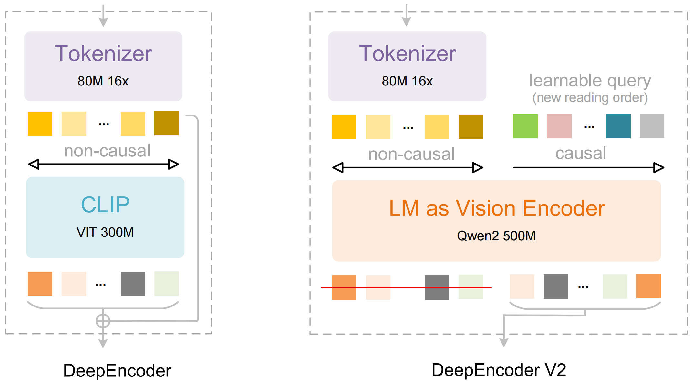

# Spring AI 增强扩展：Spring AI 集成 DeepSeek-OCR 2 本地部署

> 基于 Spring AI + Ollama/vLLM 实现 DeepSeek-OCR 2 的本地化 OCR 服务，提供 RESTful API 接口，支持文档解析、表格提取、公式识别等功能。

## 一、项目概述

### 1.1 项目定位

本项目是 Spring AI 框架下集成 DeepSeek-OCR 2 视觉语言模型的示例，展示了如何在 Java/Spring Boot 应用中实现本地化的 OCR 服务。

### 1.2 技术栈

| 组件 | 版本 | 说明 |
|------|------|------|
| Spring Boot | 3.5.6 | 基础框架 |
| Spring AI | 1.1.4 | AI 能力集成 |
| Ollama / vLLM | - | 模型推理服务 |
| DeepSeek-OCR-2 | - | OCR 视觉语言模型 |

### 1.3 核心功能

- ✅ 文档解析：复杂文档转 Markdown
- ✅ 表格提取：识别表格结构
- ✅ 公式识别：数学公式提取
- ✅ 自定义 Prompt：灵活的任务控制
- ✅ RESTful API：标准化接口设计
- ✅ Swagger 文档：在线 API 文档

---

## 二、DeepSeek-OCR 2 模型简介

> 本节内容来自 [ModelScope DeepSeek-OCR-2](https://www.modelscope.cn/models/deepseek-ai/DeepSeek-OCR-2) 官方页面。

### 2.1 模型介绍

**DeepSeek-OCR 2: Visual Causal Flow**



<p align="center">
Explore more human-like visual encoding.
</p>

### 2.2 核心特性

| 特性 | 说明 |
|------|------|
| **Visual Causal Flow** | 创新的视觉因果流架构，实现更接近人类视觉的编码 |
| **动态分辨率** | 支持 (0-6)×768×768 + 1×1024×1024 分辨率 |
| **视觉令牌优化** | (0-6)×144 + 256 视觉令牌 ✅ |
| **多任务支持** | 文档解析、表格提取、公式识别、图表分析 |
| **双语优化** | 中英文深度优化，支持多语言文档 |
| **OmniDocBench 领先** | 在主要文档理解基准上取得业界领先结果 |

### 2.3 支持模式

- **动态分辨率**
  - 默认：`(0-6)×768×768 + 1×1024×1024` → `(0-6)×144 + 256` 视觉令牌 ✅

### 2.4 主要 Prompt 格式

DeepSeek-OCR 2 使用特定的 Prompt 格式：

```python
# 文档转 Markdown（带布局）
"<image>\n<|grounding|>Convert the document to markdown."

# 纯 OCR（无布局）
"<image>\nFree OCR."
```

**关键标记说明**：
- `<image>` - 图片输入标记
- `<|grounding|>` - 启用布局感知模式，提取文档结构
- **注意**：所有 Prompt 必须以 `<image>` 开头

### 2.5 使用要求

**环境要求**：CUDA 11.8 + Python 3.12.9 + torch 2.6.0

```bash
# 核心依赖
torch==2.6.0
transformers==4.46.3
tokenizers==0.20.3
einops
addict
easydict
flash-attn==2.7.3  # 需要 --no-build-isolation 安装
```

### 2.6 vLLM 推理

参考 [🌟GitHub](https://github.com/deepseek-ai/DeepSeek-OCR-2/) 获取模型推理加速和 PDF 处理等指南。

**主要功能**：
- **图片处理**：流式输出
- **PDF 处理**：并发处理（速度与 DeepSeek-OCR 相当）
- **批量评估**：支持 OmniDocBench v1.5 等基准测试

### 2.7 致谢

我们感谢以下有价值的模型和思想：
- [DeepSeek-OCR](https://github.com/deepseek-ai/DeepSeek-OCR/)
- [Vary](https://github.com/Ucas-HaoranWei/Vary/)
- [GOT-OCR2.0](https://github.com/Ucas-HaoranWei/GOT-OCR2.0/)
- [MinerU](https://github.com/opendatalab/MinerU)
- [PaddleOCR](https://github.com/PaddlePaddle/PaddleOCR)

同时感谢基准测试 [OmniDocBench](https://github.com/opendatalab/OmniDocBench)。

---

## 三、性能基准

> 本节内容来自 [ModelScope DeepSeek-OCR-2](https://www.modelscope.cn/models/deepseek-ai/DeepSeek-OCR-2) 官方页面。

### 3.1 OmniDocBench 性能

DeepSeek-OCR 2 在主要文档理解基准测试中表现优异，特别是在以下方面：

| 任务 | 性能表现 |
|------|----------|
| **文档解析** | 高质量 Markdown 输出，保持原始文档结构 |
| **表格识别** | 准确提取表格内容，支持复杂表格结构 |
| **公式识别** | 高精度数学公式提取和渲染 |
| **双语文档** | 中英文混合文档处理能力强 |
| **复杂布局** | 支持多栏、图表、代码块等复杂布局 |

### 3.2 动态分辨率优势

DeepSeek-OCR 2 采用创新的动态分辨率支持：

| 分辨率配置 | 视觉令牌 | 优势 |
|------------|----------|------|
| `(0-6)×768×768 + 1×1024×1024` | `(0-6)×144 + 256` | 灵活适配不同文档尺寸 |
| 多尺度处理 | 自适应视觉令牌分配 | 优化计算效率 |
| 高分辨率支持 | 256 视觉令牌 | 保留细节信息 |

### 3.3 推理效率

| 指标 | 性能 |
|------|------|
| **视觉编码效率** | 高效的视觉因果流架构 |
| **内存使用** | 优化的视觉令牌管理 |
| **并发处理** | 支持批量文档处理 |
| **与 DeepSeek-OCR 相当** | 在 PDF 处理上保持同等速度 |

### 3.4 实际场景表现

DeepSeek-OCR 2 在实际业务场景中表现稳健：

| 场景 | 优势 |
|------|------|
| **技术文档** | 准确识别代码片段和技术图表 |
| **学术论文** | 保持公式和参考文献格式 |
| **商业报告** | 提取表格数据和关键指标 |
| **多语言文档** | 支持中英文混合内容 |

---

## 四、项目结构

```
spring-ai-ollama-ocr-deepseek/
├── pom.xml                                    # Maven 配置
├── README.md                                  # 项目说明
├── .gitignore
└── src/main/
    ├── java/com/github/partmeai/ollama/
    │   ├── SpringAiOllamaOcrDeepseekApplication.java  # 启动类
    │   ├── config/
    │   │   ├── SwaggerConfig.java             # Swagger 配置
    │   │   └── WebConfig.java                 # Web 配置
    │   ├── controller/
    │   │   └── OcrController.java             # REST 控制器
    │   ├── service/
    │   │   └── DeepSeekOcrService.java        # OCR 服务
    │   ├── request/
    │   │   └── OcrRequest.java                # 请求对象
    │   └── response/
    │       └── OcrResponse.java               # 响应对象
    └── resources/
        ├── application.properties             # 应用配置
        └── conf/
            └── log4j2-dev.xml                 # 日志配置
```

---

## 五、核心配置

### 4.1 Maven 依赖

```xml
<dependencies>
    <!-- Spring AI Ollama -->
    <dependency>
        <groupId>org.springframework.ai</groupId>
        <artifactId>spring-ai-starter-model-ollama</artifactId>
    </dependency>
    
    <!-- Spring AI 重试 -->
    <dependency>
        <groupId>org.springframework.ai</groupId>
        <artifactId>spring-ai-autoconfigure-retry</artifactId>
    </dependency>
    
    <!-- API 文档 -->
    <dependency>
        <groupId>com.github.xiaoymin</groupId>
        <artifactId>knife4j-openapi3-jakarta-spring-boot-starter</artifactId>
    </dependency>
    
    <!-- Web 服务器 -->
    <dependency>
        <groupId>org.springframework.boot</groupId>
        <artifactId>spring-boot-starter-undertow</artifactId>
    </dependency>
</dependencies>
```

### 4.2 应用配置

```properties
# Ollama / vLLM 配置
spring.ai.ollama.base-url=http://localhost:11434
spring.ai.ollama.chat.enabled=true
spring.ai.ollama.chat.options.model=deepseek-ai/DeepSeek-OCR-2
spring.ai.ollama.chat.options.temperature=0
spring.ai.ollama.embedding.enabled=false

# Spring AI 重试配置
spring.ai.retry.max-attempts=3
spring.ai.retry.backoff.initial-interval=2000
spring.ai.retry.backoff.multiplier=2
spring.ai.retry.backoff.max-interval=5000

# Server 配置
server.port=8080
spring.application.name=spring-ai-ollama-ocr-deepseek

# Swagger 配置
springdoc.swagger-ui.path=/swagger-ui.html
springdoc.api-docs.path=/api-docs
```

### 4.3 配置说明

| 配置项 | 说明 | 推荐值 |
|--------|------|--------|
| `spring.ai.ollama.base-url` | Ollama/vLLM 服务地址 | `http://localhost:11434` 或 `http://localhost:8000/v1` |
| `spring.ai.ollama.chat.options.model` | 模型名称 | `deepseek-ai/DeepSeek-OCR-2` |
| `spring.ai.ollama.chat.options.temperature` | 温度参数 | `0`（确定性输出） |
| `spring.ai.retry.max-attempts` | 最大重试次数 | `3` |

---

## 六、代码实现详解

### 5.1 请求/响应对象

**OcrRequest.java**

```java
package com.github.partmeai.ollama.request;

import io.swagger.v3.oas.annotations.media.Schema;

public class OcrRequest {

    @Schema(description = "Base64 编码的图片数据", required = true)
    private String imageBase64;

    @Schema(description = "自定义 Prompt（可选）")
    private String prompt;

    // getter/setter
}
```

**OcrResponse.java**

```java
package com.github.partmeai.ollama.response;

import io.swagger.v3.oas.annotations.media.Schema;

public class OcrResponse {

    @Schema(description = "是否成功")
    private boolean success;

    @Schema(description = "识别结果")
    private String result;

    @Schema(description = "错误信息")
    private String error;

    @Schema(description = "处理时间（毫秒）")
    private long processingTime;

    public static OcrResponse success(String result, long processingTime) {
        OcrResponse response = new OcrResponse(true, result);
        response.setProcessingTime(processingTime);
        return response;
    }

    public static OcrResponse error(String error) {
        OcrResponse response = new OcrResponse(false, null);
        response.setError(error);
        return response;
    }
}
```

### 5.2 OCR 服务实现

**DeepSeekOcrService.java**

```java
package com.github.partmeai.ollama.service;

import com.github.partmeai.ollama.response.OcrResponse;
import org.springframework.ai.ollama.OllamaChatModel;
import org.springframework.ai.chat.messages.Media;
import org.springframework.ai.chat.messages.UserMessage;
import org.springframework.ai.chat.prompt.Prompt;
import org.springframework.beans.factory.annotation.Autowired;
import org.springframework.stereotype.Service;
import org.springframework.util.MimeTypeUtils;

import java.util.List;

@Service
public class DeepSeekOcrService {

    private final OllamaChatModel chatModel;

    // DeepSeek-OCR 2 Prompt 模板
    private static final String PROMPT_MARKDOWN = "<image>\n<|grounding|>Convert the document to markdown.";
    private static final String PROMPT_FREE_OCR = "<image>\nFree OCR.";
    private static final String PROMPT_TABLE = "<image>\n<|grounding|>Extract the table content.";
    private static final String PROMPT_FORMULA = "<image>\n<|grounding|>Extract the formula.";

    @Autowired
    public DeepSeekOcrService(OllamaChatModel chatModel) {
        this.chatModel = chatModel;
    }

    public OcrResponse convertToMarkdown(String imageBase64) {
        return processImage(imageBase64, PROMPT_MARKDOWN);
    }

    public OcrResponse freeOcr(String imageBase64) {
        return processImage(imageBase64, PROMPT_FREE_OCR);
    }

    public OcrResponse extractTable(String imageBase64) {
        return processImage(imageBase64, PROMPT_TABLE);
    }

    public OcrResponse extractFormula(String imageBase64) {
        return processImage(imageBase64, PROMPT_FORMULA);
    }

    public OcrResponse processImage(String imageBase64, String prompt) {
        long startTime = System.currentTimeMillis();
        
        try {
            // 构建图片媒体对象
            Media imageMedia = new Media(MimeTypeUtils.IMAGE_JPEG, imageBase64);
            
            // 构建用户消息
            UserMessage userMessage = new UserMessage(prompt, List.of(imageMedia));
            Prompt chatPrompt = new Prompt(List.of(userMessage));
            
            // 调用模型
            String result = chatModel.call(chatPrompt).getResult().getOutput().getText();
            
            long processingTime = System.currentTimeMillis() - startTime;
            return OcrResponse.success(result, processingTime);
        } catch (Exception e) {
            return OcrResponse.error("OCR 处理失败: " + e.getMessage());
        }
    }

    public OcrResponse processImageWithCustomPrompt(String imageBase64, String customPrompt) {
        return processImage(imageBase64, customPrompt);
    }
}
```

### 5.3 REST 控制器

**OcrController.java**

```java
package com.github.partmeai.ollama.controller;

import com.github.partmeai.ollama.request.OcrRequest;
import com.github.partmeai.ollama.response.OcrResponse;
import com.github.partmeai.ollama.service.DeepSeekOcrService;
import io.swagger.v3.oas.annotations.Operation;
import io.swagger.v3.oas.annotations.tags.Tag;
import org.springframework.beans.factory.annotation.Autowired;
import org.springframework.http.ResponseEntity;
import org.springframework.web.bind.annotation.*;

@RestController
@RequestMapping("/v1/ocr")
@Tag(name = "OCR API", description = "基于 DeepSeek-OCR 的 OCR 识别接口")
public class OcrController {

    private final DeepSeekOcrService ocrService;

    @Autowired
    public OcrController(DeepSeekOcrService ocrService) {
        this.ocrService = ocrService;
    }

    @PostMapping("/markdown")
    @Operation(summary = "Markdown 转换", description = "将文档转换为 Markdown 格式")
    public ResponseEntity<OcrResponse> convertToMarkdown(@RequestBody OcrRequest request) {
        OcrResponse response = ocrService.convertToMarkdown(request.getImageBase64());
        return ResponseEntity.ok(response);
    }

    @PostMapping("/free")
    @Operation(summary = "纯 OCR", description = "无布局的纯文本识别")
    public ResponseEntity<OcrResponse> freeOcr(@RequestBody OcrRequest request) {
        OcrResponse response = ocrService.freeOcr(request.getImageBase64());
        return ResponseEntity.ok(response);
    }

    @PostMapping("/table")
    @Operation(summary = "表格提取", description = "提取表格内容")
    public ResponseEntity<OcrResponse> extractTable(@RequestBody OcrRequest request) {
        OcrResponse response = ocrService.extractTable(request.getImageBase64());
        return ResponseEntity.ok(response);
    }

    @PostMapping("/formula")
    @Operation(summary = "公式提取", description = "提取数学公式")
    public ResponseEntity<OcrResponse> extractFormula(@RequestBody OcrRequest request) {
        OcrResponse response = ocrService.extractFormula(request.getImageBase64());
        return ResponseEntity.ok(response);
    }

    @PostMapping("/custom")
    @Operation(summary = "自定义 Prompt", description = "使用自定义 Prompt 进行 OCR")
    public ResponseEntity<OcrResponse> customOcr(@RequestBody OcrRequest request) {
        String prompt = request.getPrompt() != null 
            ? request.getPrompt() 
            : "<image>\n<|grounding|>Convert the document to markdown.";
        OcrResponse response = ocrService.processImageWithCustomPrompt(
            request.getImageBase64(), prompt
        );
        return ResponseEntity.ok(response);
    }
}
```

---

## 七、API 接口说明

### 6.1 接口列表

| 方法 | 路径 | 说明 |
|------|------|------|
| POST | `/v1/ocr/markdown` | 文档转 Markdown |
| POST | `/v1/ocr/free` | 纯文本 OCR |
| POST | `/v1/ocr/table` | 表格提取 |
| POST | `/v1/ocr/formula` | 公式提取 |
| POST | `/v1/ocr/custom` | 自定义 Prompt |

### 6.2 请求格式

```json
{
  "imageBase64": "base64编码的图片数据",
  "prompt": "可选的自定义Prompt"
}
```

### 6.3 响应格式

```json
{
  "success": true,
  "result": "识别结果内容...",
  "error": null,
  "processingTime": 1234
}
```

---

## 八、部署方式

### 方式一：Ollama 部署

#### 1. 安装 Ollama

```bash
# Linux/macOS
curl -fsSL https://ollama.com/install.sh | sh
```

#### 2. 配置模型

由于 DeepSeek-OCR-2 可能未在 Ollama 官方仓库发布，可通过以下方式：

```bash
# 创建 Modelfile
echo 'FROM deepseek-ai/DeepSeek-OCR-2' > Modelfile

# 创建模型
ollama create deepseek-ocr-2 -f Modelfile
```

#### 3. 启动服务

```bash
ollama serve
```

#### 4. 配置 Spring AI

```properties
spring.ai.ollama.base-url=http://localhost:11434
spring.ai.ollama.chat.options.model=deepseek-ocr-2
```

### 方式二：vLLM 部署

#### 1. 安装 vLLM

```bash
pip install vllm>=0.6.0
```

#### 2. 启动服务

```bash
vllm serve deepseek-ai/DeepSeek-OCR-2 \
  --dtype half \
  --trust-remote-code \
  --enforce-eager \
  --port 8000
```

#### 3. 配置 Spring AI

```properties
spring.ai.ollama.base-url=http://localhost:8000/v1
spring.ai.ollama.chat.options.model=deepseek-ai/DeepSeek-OCR-2
```

---

## 八、使用示例

### 8.1 cURL 调用

```bash
# 文档转 Markdown
curl -X POST http://localhost:8080/v1/ocr/markdown \
  -H "Content-Type: application/json" \
  -d '{"imageBase64": "'$(base64 -w 0 document.png)'"}'

# 表格提取
curl -X POST http://localhost:8080/v1/ocr/table \
  -H "Content-Type: application/json" \
  -d '{"imageBase64": "'$(base64 -w 0 table.png)'"}'
```

### 8.2 Java 客户端

```java
import org.springframework.web.client.RestTemplate;
import org.springframework.http.HttpEntity;
import org.springframework.http.HttpHeaders;
import java.util.Base64;
import java.nio.file.Files;
import java.nio.file.Paths;

public class OcrClient {
    
    private final RestTemplate restTemplate = new RestTemplate();
    private final String baseUrl = "http://localhost:8080/v1/ocr";
    
    public String convertToMarkdown(String imagePath) throws Exception {
        byte[] imageBytes = Files.readAllBytes(Paths.get(imagePath));
        String base64 = Base64.getEncoder().encodeToString(imageBytes);
        
        HttpHeaders headers = new HttpHeaders();
        headers.set("Content-Type", "application/json");
        
        String body = String.format("{\"imageBase64\": \"%s\"}", base64);
        HttpEntity<String> request = new HttpEntity<>(body, headers);
        
        OcrResponse response = restTemplate.postForObject(
            baseUrl + "/markdown", 
            request, 
            OcrResponse.class
        );
        
        return response.isSuccess() ? response.getResult() : null;
    }
}
```

### 8.3 Python 客户端

```python
import requests
import base64

def ocr_markdown(image_path):
    with open(image_path, "rb") as f:
        image_base64 = base64.b64encode(f.read()).decode()
    
    response = requests.post(
        "http://localhost:8080/v1/ocr/markdown",
        json={"imageBase64": image_base64}
    )
    
    result = response.json()
    if result["success"]:
        return result["result"]
    else:
        raise Exception(result["error"])

# 使用示例
markdown = ocr_markdown("document.png")
print(markdown)
```

---

## 九、运行项目

### 9.1 编译

```bash
cd spring-ai-examples/spring-ai-ollama-ocr-deepseek
mvn clean package -DskipTests
```

### 9.2 运行

```bash
java -jar target/spring-ai-ollama-ocr-deepseek-1.0.0-SNAPSHOT.jar

# 或使用 Maven
mvn spring-boot:run
```

### 9.3 访问 API 文档

启动后访问：http://localhost:8080/swagger-ui.html

---

## 十、常见问题

### Q1: Ollama 连接失败？

检查 Ollama 服务是否运行：

```bash
curl http://localhost:11434/api/tags
```

### Q2: 模型输出格式不正确？

确保使用正确的 Prompt 格式：

```java
// 正确格式
String prompt = "<image>\n<|grounding|>Convert the document to markdown.";
```

### Q3: 内存不足？

调整 JVM 参数：

```bash
java -Xmx4g -jar target/spring-ai-ollama-ocr-deepseek-1.0.0-SNAPSHOT.jar
```

---

## 十一、许可证

- **DeepSeek-OCR 2 模型**：Apache License 2.0

DeepSeek-OCR 2 采用 Apache License 2.0 开源许可证，用户在使用本项目时应遵守该许可证的相关条款。

---

## 十二、参考资源

- **DeepSeek-OCR-2 官方**：https://huggingface.co/deepseek-ai/DeepSeek-OCR-2
- **ModelScope 镜像**：https://www.modelscope.cn/models/deepseek-ai/DeepSeek-OCR-2
- **Spring AI 文档**：https://docs.spring.io/spring-ai/reference/
- **Ollama 官网**：https://ollama.com/
- **vLLM 文档**：https://docs.vllm.ai/

---


