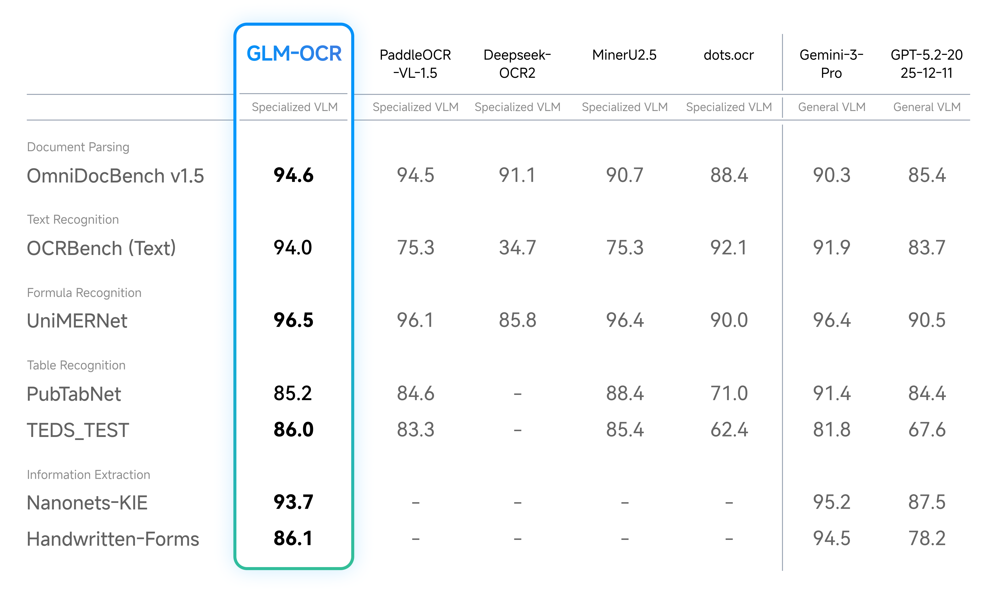
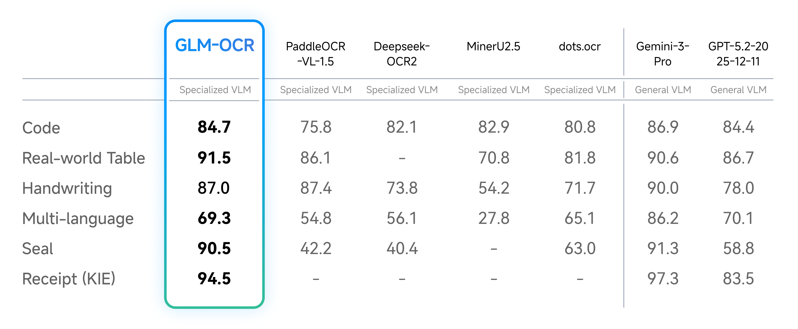

# Spring AI 增强扩展：Spring AI 集成 GLM-OCR 本地部署

> 基于 Spring AI + Ollama/vLLM 实现 GLM-OCR 的本地化 OCR 服务，提供 RESTful API 接口，支持文本识别、表格识别、公式识别和关键信息提取。

## 一、项目概述

### 1.1 项目定位

本项目是 Spring AI 框架下集成 GLM-OCR 视觉语言模型的示例，展示了如何在 Java/Spring Boot 应用中实现本地化的 OCR 服务。

### 1.2 技术栈

| 组件 | 版本 | 说明 |
|------|------|------|
| Spring Boot | 3.5.6 | 基础框架 |
| Spring AI | 1.1.4 | AI 能力集成 |
| Ollama / vLLM | - | 模型推理服务 |
| GLM-OCR | 0.9B | OCR 视觉语言模型 |

### 1.3 核心功能

- ✅ 文本识别：识别图片中的文本内容
- ✅ 表格识别：识别表格并转换为 Markdown
- ✅ 公式识别：识别数学公式
- ✅ 图表识别：识别图表数据
- ✅ 关键信息提取：提取文档中的关键信息
- ✅ RESTful API：标准化接口设计
- ✅ Swagger 文档：在线 API 文档

---

## 二、GLM-OCR 模型简介

> 本节内容来自 [ModelScope GLM-OCR](https://www.modelscope.cn/models/ZhipuAI/GLM-OCR) 官方页面。

### 2.1 模型介绍

GLM-OCR 是一个面向复杂文档理解的多模态 OCR 模型，基于 **GLM-V 编码器-解码器架构**构建。模型引入了 **Multi-Token Prediction (MTP)** 损失和稳定的全任务强化学习，以提高训练效率、识别准确性和泛化能力。

模型集成了以下核心组件：

| 组件 | 说明 |
|------|------|
| **CogViT 视觉编码器** | 在大规模图像-文本数据上预训练，提供强大的视觉特征提取能力 |
| **轻量级跨模态连接器** | 高效的令牌下采样，减少计算开销 |
| **GLM-0.5B 语言解码器** | 轻量级语言模型，支持多语言生成 |
| **PP-DocLayout-V3** | 两阶段流水线：布局分析 + 并行识别 |

结合基于 PP-DocLayout-V3 的两阶段流水线（布局分析和并行识别），GLM-OCR 能够在各种文档布局中提供稳健且高质量的 OCR 性能。

### 2.2 核心特性

| 特性 | 说明 |
|------|------|
| **业界领先的性能** | OmniDocBench V1.5 得分 94.62，排名第一，在公式识别、表格识别和信息提取等主要文档理解基准上取得业界领先结果 |
| **实际场景优化** | 针对实际业务场景设计和优化，在复杂表格、代码密集文档、印章等具有挑战性的实际布局上保持稳健性能 |
| **高效推理** | 仅 0.9B 参数，支持 vLLM、SGLang、Ollama 部署，显著降低推理延迟和计算成本，适合高并发服务和边缘部署 |
| **易于使用** | 完全开源，配备完整的 SDK 和推理工具链，提供简单的安装、一行调用和与现有生产流程的无缝集成 |

### 2.3 Prompt 格式

GLM-OCR 目前支持两类 Prompt 场景：

**文档解析** – 从文档中提取原始内容：

| 任务 | Prompt |
|------|--------|
| 文本识别 | `Text Recognition:` |
| 公式识别 | `Formula Recognition:` |
| 表格识别 | `Table Recognition:` |

**信息提取** – 从文档中提取结构化信息，Prompt 必须遵循严格的 JSON Schema：

```
请按下列JSON格式输出图中信息:
{
    "id_number": "",
    "last_name": "",
    "first_name": "",
    "date_of_birth": "",
    "address": {
        "street": "",
        "city": "",
        "state": "",
        "zip_code": ""
    },
    "dates": {
        "issue_date": "",
        "expiration_date": ""
    },
    "sex": ""
}
```

> ⚠️ **注意**：使用信息提取时，输出必须严格遵循定义的 JSON Schema，以确保下游处理的兼容性。

---

## 三、性能基准

> 本节内容来自 [ModelScope GLM-OCR](https://www.modelscope.cn/models/ZhipuAI/GLM-OCR) 官方页面。

### 3.1 OmniDocBench V1.5

| 模型 | 得分 | 排名 |
|------|------|------|
| **GLM-OCR** | **94.62** | **#1** |
| PaddleOCR-VL 1.5 | 94.50 | #2 |
| Qianfan-OCR | 93.12 | #3 |

### 3.2 文档解析与信息提取性能



### 3.3 实际场景性能



### 3.4 推理速度

在相同硬件和测试条件下（单副本、单并发），评估不同 OCR 方法解析和导出 Markdown 文件的性能。结果显示 GLM-OCR 在 PDF 文档处理上达到 **1.86 pages/sec** 的吞吐量，在图片处理上达到 **0.67 images/sec**，显著优于同类模型。

---

## 四、项目结构

```
spring-ai-ollama-ocr-glm/
├── pom.xml                                    # Maven 配置
├── README.md                                  # 项目说明
├── .gitignore
└── src/main/
    ├── java/com/github/teachingai/ollama/
    │   ├── SpringAiOllamaOcrGlmApplication.java       # 启动类
    │   ├── config/
    │   │   ├── SwaggerConfig.java             # Swagger 配置
    │   │   └── WebConfig.java                 # Web 配置
    │   ├── controller/
    │   │   └── OcrController.java             # REST 控制器
    │   ├── service/
    │   │   └── GlmOcrService.java             # OCR 服务
    │   ├── request/
    │   │   └── OcrRequest.java                # 请求对象
    │   └── response/
    │       └── OcrResponse.java               # 响应对象
    └── resources/
        ├── application.properties             # 应用配置
        └── conf/
            └── log4j2-dev.xml                 # 日志配置
```

---

## 五、核心配置

### 5.1 Maven 依赖

```xml
<?xml version="1.0" encoding="UTF-8"?>
<project xmlns="http://maven.apache.org/POM/4.0.0"
         xmlns:xsi="http://www.w3.org/2001/XMLSchema-instance"
         xsi:schemaLocation="http://maven.apache.org/POM/4.0.0 https://maven.apache.org/xsd/maven-4.0.0.xsd">
    <modelVersion>4.0.0</modelVersion>
    <parent>
        <groupId>com.github.partmeai</groupId>
        <artifactId>spring-ai-examples</artifactId>
        <version>${revision}</version>
        <relativePath>../pom.xml</relativePath>
    </parent>

    <artifactId>spring-ai-ollama-ocr-glm</artifactId>

    <dependencies>
        <!-- Spring AI Ollama -->
        <dependency>
            <groupId>org.springframework.ai</groupId>
            <artifactId>spring-ai-starter-model-ollama</artifactId>
        </dependency>
        
        <!-- Spring AI 重试 -->
        <dependency>
            <groupId>org.springframework.ai</groupId>
            <artifactId>spring-ai-autoconfigure-retry</artifactId>
        </dependency>
        
        <!-- API 文档 -->
        <dependency>
            <groupId>com.github.xiaoymin</groupId>
            <artifactId>knife4j-openapi3-jakarta-spring-boot-starter</artifactId>
        </dependency>
        
        <!-- Web 服务器 -->
        <dependency>
            <groupId>org.springframework.boot</groupId>
            <artifactId>spring-boot-starter-undertow</artifactId>
        </dependency>
    </dependencies>
</project>
```

### 5.2 应用配置

```properties
# Ollama 配置
spring.ai.ollama.base-url=http://localhost:11434
spring.ai.ollama.chat.enabled=true
spring.ai.ollama.chat.options.model=glm-ocr
spring.ai.ollama.chat.options.temperature=0.1
spring.ai.ollama.embedding.enabled=false

# Spring AI 重试配置
spring.ai.retry.max-attempts=3
spring.ai.retry.backoff.initial-interval=2000
spring.ai.retry.backoff.multiplier=2
spring.ai.retry.backoff.max-interval=5000

# Server 配置
server.port=8080
spring.application.name=spring-ai-ollama-ocr-glm

# Swagger 配置
springdoc.swagger-ui.path=/swagger-ui.html
springdoc.api-docs.path=/api-docs

# Logging 配置
logging.config=classpath:conf/log4j2-dev.xml
```

### 5.3 配置说明

| 配置项 | 说明 | 推荐值 |
|--------|------|--------|
| `spring.ai.ollama.base-url` | Ollama/vLLM 服务地址 | `http://localhost:11434` 或 `http://localhost:8080/v1` |
| `spring.ai.ollama.chat.options.model` | 模型名称 | `glm-ocr` |
| `spring.ai.ollama.chat.options.temperature` | 温度参数 | `0.1`（较低温度保证稳定性） |
| `spring.ai.retry.max-attempts` | 最大重试次数 | `3` |

---

## 六、代码实现详解

### 6.1 启动类

**SpringAiOllamaOcrGlmApplication.java**

```java
package com.github.partmeai.ollama;

import org.springframework.boot.SpringApplication;
import org.springframework.boot.autoconfigure.SpringBootApplication;

@SpringBootApplication
public class SpringAiOllamaOcrGlmApplication {

    public static void main(String[] args) {
        SpringApplication.run(SpringAiOllamaOcrGlmApplication.class, args);
    }
}
```

### 6.2 请求对象

**OcrRequest.java**

```java
package com.github.partmeai.ollama.request;

import io.swagger.v3.oas.annotations.media.Schema;

public class OcrRequest {

    @Schema(description = "Base64 编码的图片数据", required = true)
    private String imageBase64;

    @Schema(description = "自定义 Prompt（可选）")
    private String prompt;

    public String getImageBase64() {
        return imageBase64;
    }

    public void setImageBase64(String imageBase64) {
        this.imageBase64 = imageBase64;
    }

    public String getPrompt() {
        return prompt;
    }

    public void setPrompt(String prompt) {
        this.prompt = prompt;
    }
}
```

### 6.3 响应对象

**OcrResponse.java**

```java
package com.github.partmeai.ollama.response;

import io.swagger.v3.oas.annotations.media.Schema;

public class OcrResponse {

    @Schema(description = "是否成功")
    private boolean success;

    @Schema(description = "识别结果")
    private String result;

    @Schema(description = "错误信息")
    private String error;

    @Schema(description = "处理时间（毫秒）")
    private long processingTime;

    public OcrResponse() {
    }

    public OcrResponse(boolean success, String result) {
        this.success = success;
        this.result = result;
    }

    public static OcrResponse success(String result, long processingTime) {
        OcrResponse response = new OcrResponse(true, result);
        response.setProcessingTime(processingTime);
        return response;
    }

    public static OcrResponse error(String error) {
        OcrResponse response = new OcrResponse(false, null);
        response.setError(error);
        return response;
    }

    // getter/setter 省略...
}
```

### 6.4 OCR 服务实现

**GlmOcrService.java**

```java
package com.github.partmeai.ollama.service;

import com.github.partmeai.ollama.response.OcrResponse;
import org.springframework.ai.ollama.OllamaChatModel;
import org.springframework.ai.chat.messages.Media;
import org.springframework.ai.chat.messages.UserMessage;
import org.springframework.ai.chat.prompt.Prompt;
import org.springframework.beans.factory.annotation.Autowired;
import org.springframework.stereotype.Service;
import org.springframework.util.MimeTypeUtils;

import java.util.List;

@Service
public class GlmOcrService {

    private final OllamaChatModel chatModel;

    private static final String PROMPT_TEXT = "Text Recognition:";
    private static final String PROMPT_TABLE = "Table Recognition:";
    private static final String PROMPT_FORMULA = "Formula Recognition:";
    private static final String PROMPT_CHART = "Chart Recognition:";
    private static final String PROMPT_KIE = "Key Information Extraction:";

    @Autowired
    public GlmOcrService(OllamaChatModel chatModel) {
        this.chatModel = chatModel;
    }

    public OcrResponse recognizeText(String imageBase64) {
        return processImage(imageBase64, PROMPT_TEXT);
    }

    public OcrResponse recognizeTable(String imageBase64) {
        return processImage(imageBase64, PROMPT_TABLE);
    }

    public OcrResponse recognizeFormula(String imageBase64) {
        return processImage(imageBase64, PROMPT_FORMULA);
    }

    public OcrResponse recognizeChart(String imageBase64) {
        return processImage(imageBase64, PROMPT_CHART);
    }

    public OcrResponse extractKeyInfo(String imageBase64) {
        return processImage(imageBase64, PROMPT_KIE);
    }

    public OcrResponse processImage(String imageBase64, String prompt) {
        long startTime = System.currentTimeMillis();
        
        try {
            Media imageMedia = new Media(MimeTypeUtils.IMAGE_JPEG, imageBase64);
            UserMessage userMessage = new UserMessage(prompt, List.of(imageMedia));
            Prompt chatPrompt = new Prompt(List.of(userMessage));
            
            String result = chatModel.call(chatPrompt).getResult().getOutput().getText();
            
            long processingTime = System.currentTimeMillis() - startTime;
            return OcrResponse.success(result, processingTime);
        } catch (Exception e) {
            return OcrResponse.error("OCR 处理失败: " + e.getMessage());
        }
    }

    public OcrResponse processImageWithCustomPrompt(String imageBase64, String customPrompt) {
        return processImage(imageBase64, customPrompt);
    }
}
```

### 6.5 REST 控制器

**OcrController.java**

```java
package com.github.partmeai.ollama.controller;

import com.github.partmeai.ollama.request.OcrRequest;
import com.github.partmeai.ollama.response.OcrResponse;
import com.github.partmeai.ollama.service.GlmOcrService;
import io.swagger.v3.oas.annotations.Operation;
import io.swagger.v3.oas.annotations.tags.Tag;
import org.springframework.beans.factory.annotation.Autowired;
import org.springframework.http.ResponseEntity;
import org.springframework.web.bind.annotation.PostMapping;
import org.springframework.web.bind.annotation.RequestBody;
import org.springframework.web.bind.annotation.RequestMapping;
import org.springframework.web.bind.annotation.RestController;

@RestController
@RequestMapping("/v1/ocr")
@Tag(name = "OCR API", description = "基于 GLM-OCR 的 OCR 识别接口")
public class OcrController {

    private final GlmOcrService ocrService;

    @Autowired
    public OcrController(GlmOcrService ocrService) {
        this.ocrService = ocrService;
    }

    @PostMapping("/text")
    @Operation(summary = "文本识别", description = "识别图片中的文本内容")
    public ResponseEntity<OcrResponse> recognizeText(@RequestBody OcrRequest request) {
        OcrResponse response = ocrService.recognizeText(request.getImageBase64());
        return ResponseEntity.ok(response);
    }

    @PostMapping("/table")
    @Operation(summary = "表格识别", description = "识别表格并转换为 Markdown 格式")
    public ResponseEntity<OcrResponse> recognizeTable(@RequestBody OcrRequest request) {
        OcrResponse response = ocrService.recognizeTable(request.getImageBase64());
        return ResponseEntity.ok(response);
    }

    @PostMapping("/formula")
    @Operation(summary = "公式识别", description = "识别数学公式")
    public ResponseEntity<OcrResponse> recognizeFormula(@RequestBody OcrRequest request) {
        OcrResponse response = ocrService.recognizeFormula(request.getImageBase64());
        return ResponseEntity.ok(response);
    }

    @PostMapping("/chart")
    @Operation(summary = "图表识别", description = "识别图表数据")
    public ResponseEntity<OcrResponse> recognizeChart(@RequestBody OcrRequest request) {
        OcrResponse response = ocrService.recognizeChart(request.getImageBase64());
        return ResponseEntity.ok(response);
    }

    @PostMapping("/kie")
    @Operation(summary = "关键信息提取", description = "提取文档中的关键信息")
    public ResponseEntity<OcrResponse> extractKeyInfo(@RequestBody OcrRequest request) {
        OcrResponse response = ocrService.extractKeyInfo(request.getImageBase64());
        return ResponseEntity.ok(response);
    }

    @PostMapping("/custom")
    @Operation(summary = "自定义 Prompt", description = "使用自定义 Prompt 进行 OCR")
    public ResponseEntity<OcrResponse> customOcr(@RequestBody OcrRequest request) {
        String prompt = request.getPrompt() != null ? request.getPrompt() : "Text Recognition:";
        OcrResponse response = ocrService.processImageWithCustomPrompt(
            request.getImageBase64(), prompt
        );
        return ResponseEntity.ok(response);
    }
}
```

---

## 七、API 接口说明

### 7.1 接口列表

| 方法 | 路径 | 说明 |
|------|------|------|
| POST | `/v1/ocr/text` | 文本识别 |
| POST | `/v1/ocr/table` | 表格识别 |
| POST | `/v1/ocr/formula` | 公式识别 |
| POST | `/v1/ocr/chart` | 图表识别 |
| POST | `/v1/ocr/kie` | 关键信息提取 |
| POST | `/v1/ocr/custom` | 自定义 Prompt |

### 7.2 请求格式

```json
{
  "imageBase64": "base64编码的图片数据",
  "prompt": "可选的自定义Prompt"
}
```

### 7.3 响应格式

```json
{
  "success": true,
  "result": "识别结果内容...",
  "error": null,
  "processingTime": 1234
}
```

---

## 八、部署方式

### 方式一：Ollama 部署（推荐）

#### 1. 安装 Ollama

```bash
# Linux/macOS
curl -fsSL https://ollama.com/install.sh | sh
```

#### 2. 拉取并运行模型

```bash
ollama run glm-ocr
```

#### 3. 验证服务

```bash
# CLI 方式
ollama run glm-ocr Text Recognition: ./image.png

# API 方式
curl http://localhost:11434/api/tags
```

#### 4. 配置 Spring AI

```properties
spring.ai.ollama.base-url=http://localhost:11434
spring.ai.ollama.chat.options.model=glm-ocr
```

### 方式二：vLLM 部署

#### 1. 安装 vLLM

```bash
pip install -U vllm --extra-index-url https://wheels.vllm.ai/nightly
# 或使用 Docker
docker pull vllm/vllm-openai:nightly
```

#### 2. 安装依赖

```bash
pip install git+https://github.com/huggingface/transformers.git
```

#### 3. 启动服务

```bash
# 使用 ModelScope 镜像（国内推荐）
VLLM_USE_MODELSCOPE=true vllm serve ZhipuAI/GLM-OCR --allowed-local-media-path / --port 8080

# 或使用 HuggingFace
vllm serve zai-org/GLM-OCR --allowed-local-media-path / --port 8080
```

#### 4. 配置 Spring AI

```properties
spring.ai.ollama.base-url=http://localhost:8080/v1
spring.ai.ollama.chat.options.model=ZhipuAI/GLM-OCR
```

### 方式三：SGLang 部署

#### 1. 安装 SGLang

```bash
# 使用 Docker
docker pull lmsysorg/sglang:dev

# 或从源码安装
pip install git+https://github.com/sgl-project/sglang.git#subdirectory=python
```

#### 2. 安装依赖

```bash
pip install git+https://github.com/huggingface/transformers.git
```

#### 3. 启动服务

```bash
# 使用 ModelScope 镜像
SGLANG_USE_MODELSCOPE=true python -m sglang.launch_server --model ZhipuAI/GLM-OCR --port 8080
```

---

## 九、官方 SDK

对于文档解析任务，**强烈推荐使用[官方 SDK](https://github.com/zai-org/GLM-OCR)**。

与仅使用模型推理相比，SDK 集成了 PP-DocLayoutV3，提供完整、易用的文档解析流水线，包括布局分析和结构化输出生成，显著减少构建端到端文档智能系统的工程开销。

> **注意**：SDK 目前仅设计用于文档解析任务。对于信息提取任务，请直接使用模型推理。

### 安装 SDK

```bash
pip install glm-ocr-sdk
```

### 使用示例

```python
from glm_ocr import GLMOCR

ocr = GLMOCR()

# 文档解析
result = ocr.parse_document("document.pdf")
print(result.markdown)

# 图片解析
result = ocr.parse_image("image.png")
print(result.text)
```

---

## 十、使用示例

### 10.1 cURL 调用

```bash
# 文本识别
curl -X POST http://localhost:8080/v1/ocr/text \
  -H "Content-Type: application/json" \
  -d '{"imageBase64": "'$(base64 -w 0 document.png)'"}'

# 表格识别
curl -X POST http://localhost:8080/v1/ocr/table \
  -H "Content-Type: application/json" \
  -d '{"imageBase64": "'$(base64 -w 0 table.png)'"}'

# 关键信息提取
curl -X POST http://localhost:8080/v1/ocr/kie \
  -H "Content-Type: application/json" \
  -d '{"imageBase64": "'$(base64 -w 0 invoice.png)'"}'
```

### 10.2 Java 客户端

```java
import org.springframework.web.client.RestTemplate;
import org.springframework.http.HttpEntity;
import org.springframework.http.HttpHeaders;
import java.util.Base64;
import java.nio.file.Files;
import java.nio.file.Paths;

public class GlmOcrClient {
    
    private final RestTemplate restTemplate = new RestTemplate();
    private final String baseUrl = "http://localhost:8080/v1/ocr";
    
    public String recognizeText(String imagePath) throws Exception {
        byte[] imageBytes = Files.readAllBytes(Paths.get(imagePath));
        String base64 = Base64.getEncoder().encodeToString(imageBytes);
        
        HttpHeaders headers = new HttpHeaders();
        headers.set("Content-Type", "application/json");
        
        String body = String.format("{\"imageBase64\": \"%s\"}", base64);
        HttpEntity<String> request = new HttpEntity<>(body, headers);
        
        OcrResponse response = restTemplate.postForObject(
            baseUrl + "/text", 
            request, 
            OcrResponse.class
        );
        
        return response.isSuccess() ? response.getResult() : null;
    }
}
```

### 10.3 Python 客户端

```python
import requests
import base64

class GlmOcrClient:
    def __init__(self, base_url="http://localhost:8080/v1/ocr"):
        self.base_url = base_url
    
    def recognize_text(self, image_path):
        return self._call_api(image_path, "/text")
    
    def recognize_table(self, image_path):
        return self._call_api(image_path, "/table")
    
    def extract_key_info(self, image_path):
        return self._call_api(image_path, "/kie")
    
    def _call_api(self, image_path, endpoint):
        with open(image_path, "rb") as f:
            image_base64 = base64.b64encode(f.read()).decode()
        
        response = requests.post(
            f"{self.base_url}{endpoint}",
            json={"imageBase64": image_base64}
        )
        
        result = response.json()
        if result["success"]:
            return result["result"]
        else:
            raise Exception(result["error"])

# 使用示例
client = GlmOcrClient()
text = client.recognize_text("document.png")
print(text)
```

---

## 十一、运行项目

### 11.1 编译

```bash
cd spring-ai-examples/spring-ai-ollama-ocr-glm
mvn clean package -DskipTests
```

### 11.2 运行

```bash
java -jar target/spring-ai-ollama-ocr-glm-1.0.0-SNAPSHOT.jar

# 或使用 Maven
mvn spring-boot:run
```

### 11.3 访问 API 文档

启动后访问：http://localhost:8080/swagger-ui.html

---

## 十二、常见问题

### Q1: Ollama 连接失败？

检查 Ollama 服务是否运行：

```bash
curl http://localhost:11434/api/tags
```

### Q2: 模型输出格式不正确？

确保使用正确的 Prompt 格式：

```java
// 正确格式
String prompt = "Text Recognition:";  // 注意冒号
```

### Q3: 国内下载模型慢？

使用 ModelScope 镜像：

```bash
# vLLM
VLLM_USE_MODELSCOPE=true vllm serve ZhipuAI/GLM-OCR --port 8080

# SGLang
SGLANG_USE_MODELSCOPE=true python -m sglang.launch_server --model ZhipuAI/GLM-OCR --port 8080
```

### Q4: 内存不足？

调整 JVM 参数：

```bash
java -Xmx4g -jar target/spring-ai-ollama-ocr-glm-1.0.0-SNAPSHOT.jar
```

---

## 十三、许可证

- **GLM-OCR 模型**：MIT License
- **PP-DocLayoutV3**：Apache License 2.0

完整的 OCR 流水线集成了 [PP-DocLayoutV3](https://huggingface.co/PaddlePaddle/PP-DocLayoutV3) 用于文档布局分析，用户在使用本项目时应同时遵守这两个许可证。

---

## 参考资源

- **ModelScope 模型**：https://www.modelscope.cn/models/ZhipuAI/GLM-OCR
- **HuggingFace 模型**：https://huggingface.co/zai-org/GLM-OCR
- **Spring AI 文档**：https://docs.spring.io/spring-ai/reference/
- **Ollama 官网**：https://ollama.com/
- **技术报告**：[GLM-OCR Technical Report](https://arxiv.org/abs/2603.10910)

---

## 致谢

本项目受到以下优秀项目和社区的启发：

- [PP-DocLayout-V3](https://huggingface.co/PaddlePaddle/PP-DocLayoutV3)
- [PaddleOCR](https://github.com/PaddlePaddle/PaddleOCR)
- [MinerU](https://github.com/opendatalab/MinerU)

---


