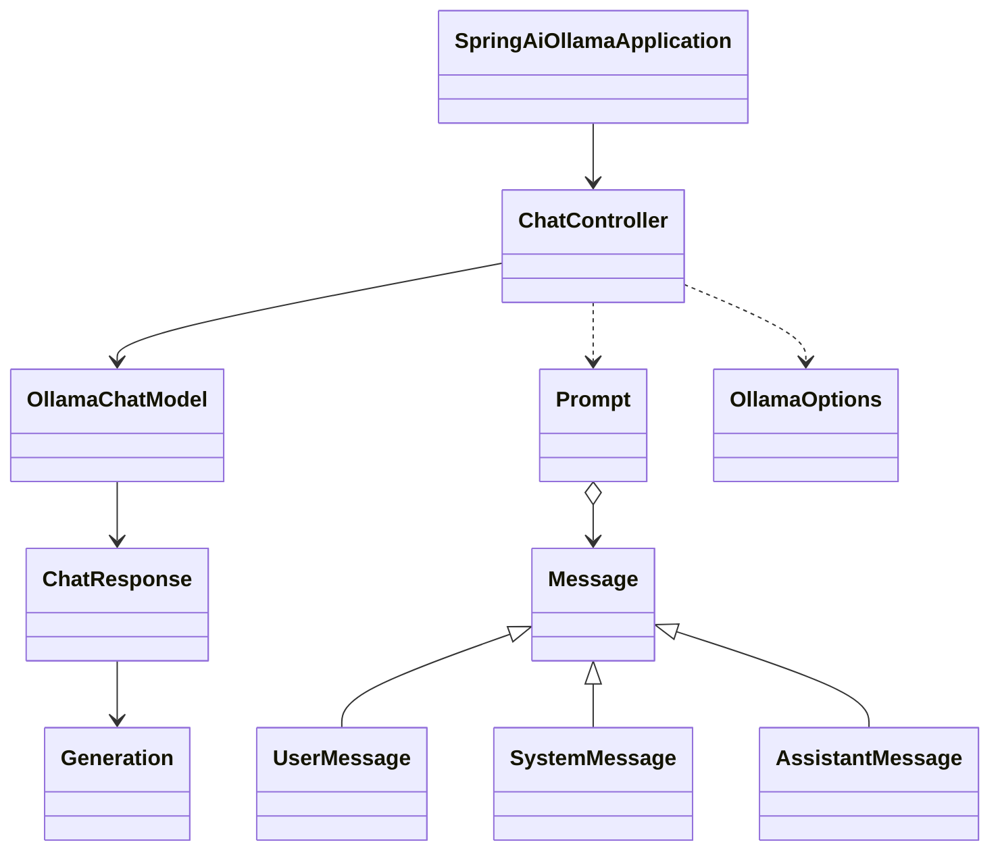
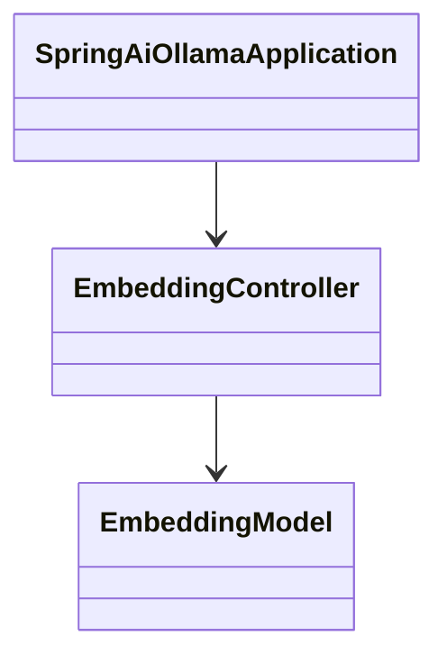
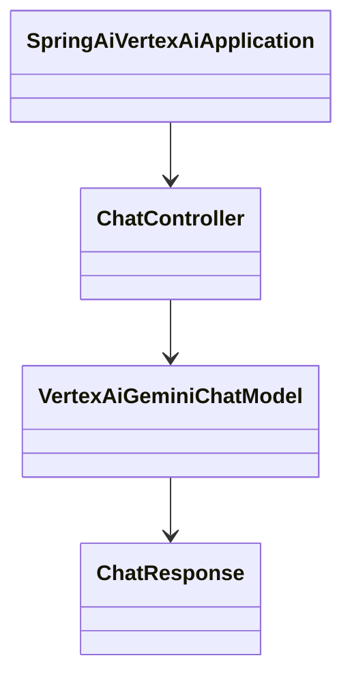

# 项目结构图与对象关系图

## 项目结构图（仓库模块分组概览）

```
spring-ai-examples/
├── 父工程（统一依赖/版本）
│   └── pom.xml
├── 文档
│   └── docs/
│       ├── README.md
│       ├── spring-ai-quick-start.md
│       └── spring-ai-text-generation.md
├── 公共模块
│   └── spring-ai-common/
├── 云端模型示例
│   ├── spring-ai-openai/
│   ├── spring-ai-azure-openai/
│   ├── spring-ai-anthropic/
│   ├── spring-ai-vertexai-gemini/
│   ├── spring-ai-qwen/
│   ├── spring-ai-qianfan/
│   ├── spring-ai-zhipuai/
│   ├── spring-ai-watsonxai/
│   ├── spring-ai-mistralai/
│   ├── spring-ai-moonshotai/
│   ├── spring-ai-minimax/
│   ├── spring-ai-huggingface/
│   └── spring-ai-amazon-bedrock/
├── 本地模型（Ollama）示例
│   ├── 基础：spring-ai-ollama-generation/、spring-ai-ollama-chat/、spring-ai-ollama-embedding/、spring-ai-ollama-vision/
│   ├── 工具与Agent：spring-ai-ollama-tools/、spring-ai-ollama-agents/
│   ├── 观测：spring-ai-ollama-observation-langfuse/、spring-ai-ollama-observation-prometheus/
│   ├── MCP：spring-ai-ollama-mcp-webmvc-{client|server}/、spring-ai-ollama-mcp-webflux-{client|server}/
│   └── 微调：spring-ai-ollama-fine-tuning/
├── RAG 检索增强（多向量库）
│   ├── spring-ai-ollama-rag-milvus/
│   ├── spring-ai-ollama-rag-neo4j/
│   ├── spring-ai-ollama-rag-opensearch/
│   ├── spring-ai-ollama-rag-elasticsearch/
│   ├── spring-ai-ollama-rag-qdrant/
│   ├── spring-ai-ollama-rag-weaviate/
│   ├── spring-ai-ollama-rag-pinecone/
│   ├── spring-ai-ollama-rag-redis/
│   ├── spring-ai-ollama-rag-pgvector/
│   ├── spring-ai-ollama-rag-chroma/
│   ├── spring-ai-ollama-rag-mongodb/
│   ├── spring-ai-ollama-rag-cassandra/
│   ├── spring-ai-ollama-rag-couchbase/
│   ├── spring-ai-ollama-rag-gemfire/
│   ├── spring-ai-ollama-rag-mariadb/
│   ├── spring-ai-ollama-rag-oracle/
│   └── spring-ai-ollama-rag-typesense/
├── 音频（TTS/ASR）
│   ├── spring-ai-ollama-audio-chattts/
│   ├── spring-ai-ollama-audio-edgetts/
│   ├── spring-ai-ollama-audio-emoti/
│   ├── spring-ai-ollama-audio-mars5tts/
│   ├── spring-ai-ollama-audio-unifiedtts/
│   └── spring-ai-ollama-audio-whisper/
├── 其他示例
│   ├── spring-ai-sql/
│   ├── spring-ai-postgresml/
│   ├── spring-ai-project-hotel-recommend/
│   └── spring-ai-llmsfreeapi/
└── 根级脚本与说明：README.md、restart.sh 等
```

## 结构说明
- 父工程 `pom.xml` 统一管理 `spring-ai.version`、`springdoc.version` 等依赖版本，聚合所有子模块
- 每个子模块为独立 Spring Boot 应用，典型包含 `入口类`、`Controller`、`application.properties`
- RAG 模块以向量库为维度划分，演示检索增强流水线的存储替换与调用一致性

## 对象关系图（典型聊天与嵌入调用链）

### 以 Ollama RAG Neo4j 模块为例（聊天）



- 入口类：`spring-ai-ollama-rag-neo4j/src/main/java/com/github/partme-ai/ollama/SpringAiOllamaApplication.java:6-13`
- 控制器：`spring-ai-ollama-rag-neo4j/.../controller/ChatController.java:23-70`
- ChatOptions/Prompt 组装：`spring-ai-ollama-rag-neo4j/.../controller/ChatController.java:51-67`
- 请求消息到模型消息映射：`spring-ai-ollama-rag-neo4j/.../request/ApiRequest.java:204-237`

### 以 Ollama RAG Neo4j 模块为例（嵌入）



- 嵌入接口：`spring-ai-ollama-rag-neo4j/.../controller/EmbeddingController.java:21-24`
- 配置示例：`spring-ai-ollama-rag-neo4j/src/main/resources/application.properties:2-7`

### Vertex AI Gemini 模块（聊天与流式）



- 入口与路由：`spring-ai-vertexai-gemini/.../SpringAiVertexAiApplication.java:11-28`
- 控制器：`spring-ai-vertexai-gemini/.../controller/ChatController.java:16-54`

